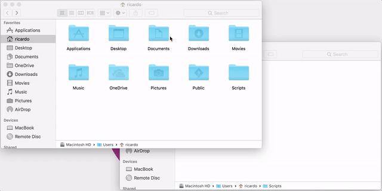
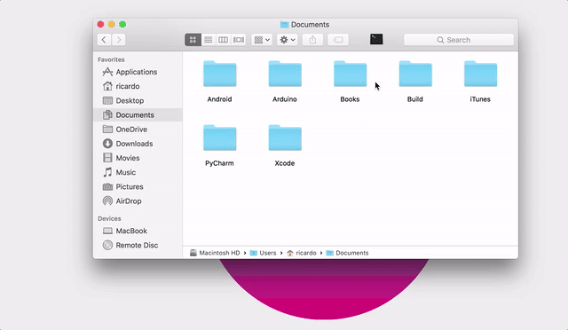

# Open in iTerm2

Opens iTerm2 on current Finder path.

This is a small Automator app based on [this blog post](http://peterdowns.com/posts/open-iterm-finder-service.html) by Peter Downs. I did this to correct some issues that arose when iTerm2 changed their Applescript API. 

Now he has a better version that has fixed everything, which you can grab [here](https://github.com/peterldowns/iterm2-finder-tools).

### Requirements

  - iTerm2 2.9+

### Installation

### Usage

